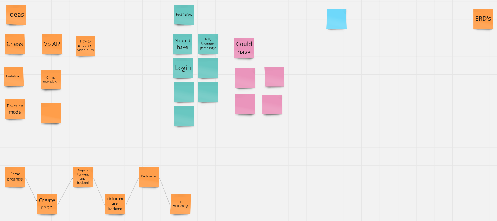
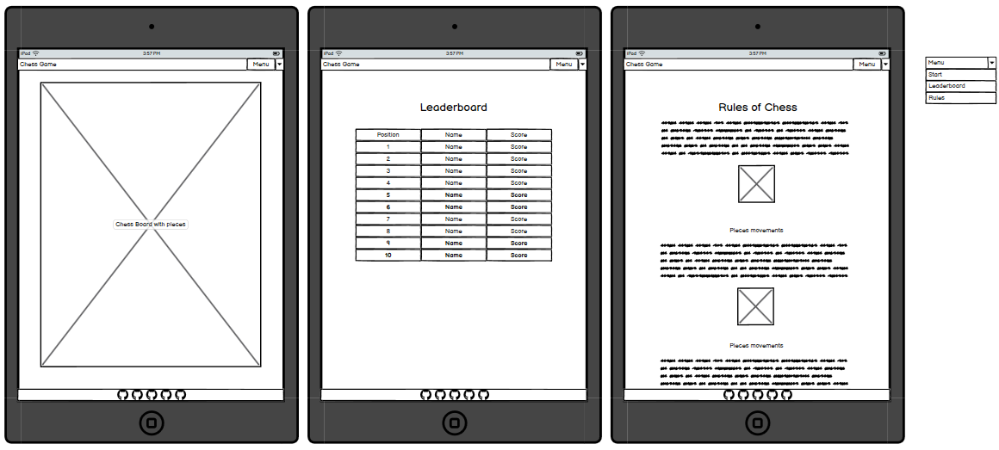
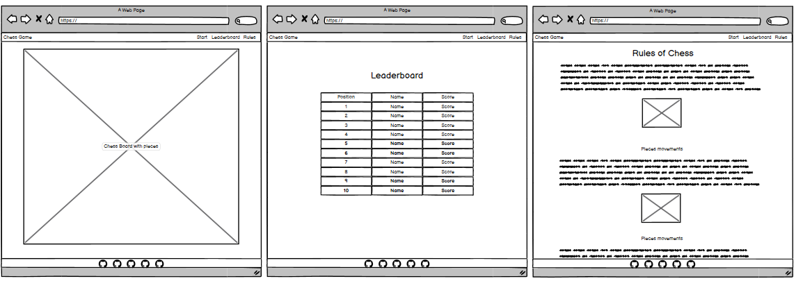
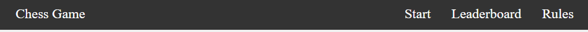
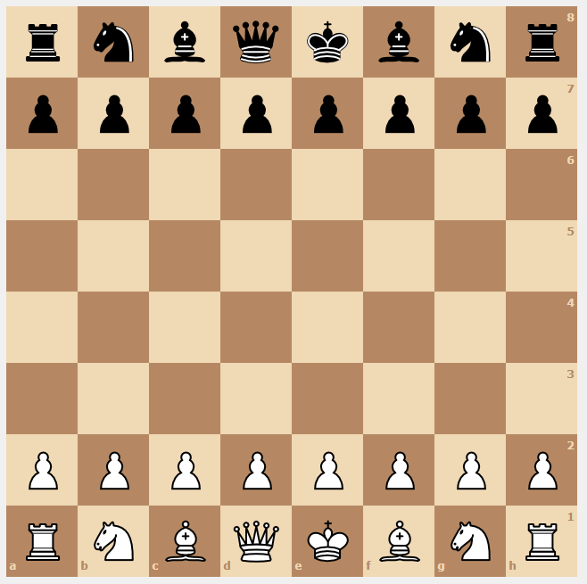
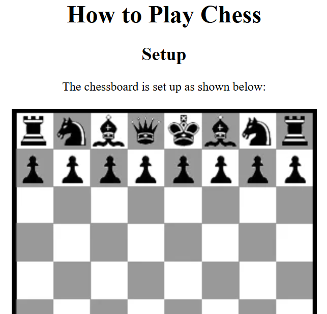
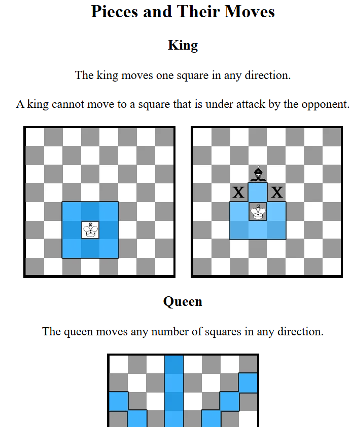
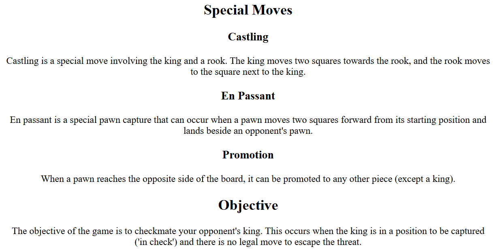
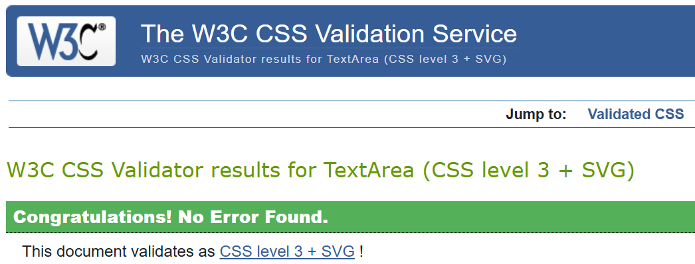

# Chess Game  <a id="top"/>
<!--    -->

## Introduction

This website was created as part of the WECA group Hackathon, to finalize the Full Stack Web Development with AI. 
Initial idea came from one of the members that wnated to do this project, but with more features that sounded too much for this project, as it was only 4 working days long,  and the group felt it was better to achieve a working MVP with basic features that our colleague can use in the future as a base for own project and get more advanced features or redo it.

<!-- Live site:  -->

## Table of Contents
- [User Experience Design](#user-experience-design)
- [Project Brief](#project-brief)
- [Users](#users)
- [Project Plan](#project-plan)
- [User Stories](#user-stories)
- [Wireframes](#wireframes)
<!--- [Design](#design)
    - [Colour Scheme](#colour-scheme)
    - [Typography](#typography)
    - [Imagery](#imagery)
- [Website Features](#website-features)
    - [Overall](#overall)
    - [Specific](#specific-features)-->
- [Responsive Design](#responsive-design)
- [Future Features](#future-features)
- [Technologies Used](#technologies-used)
- [Deployment](#deployment)
- [Testing](#testing)
    - [HTML Validation](#html-validation)
    - [CSS Validation](#css-validation)
- [Credits](#credits)
    - [Use of AI](#use-of-ai)
    - [Media References](#media-references)
    - [Acknowledgements](#acknowledgements)
    - [Owner Details](#owner-details)

[Back to top](#top)

## User Experience Design
This project shows a simple design, with intuitive menus to the game, leaderboard and rules. 
The site is responsive to different screen sizes, although on smaller screens the user might need to navitgate through the pages. 
We aim to create a seamless experience for the user. 

### Project Brief
The project goal was to create a simple website, where users can play chess and have access, if possible to a leaderboard and the rules to play chess in different areas. 
Also to make the game available to be played in different devices.
Though in smaller devices the user mihgt need to navigate through the board. 

### Users

Persona 1: The Enthusiastic Novice 
Name: James Parker Age: 25  Occupation: Software Developer  Interests: Video games, coding, strategy games  About: James has recently discovered his passion for chess and is eager to improve his skills. He enjoys playing chess with colleagues during lunch breaks and loves seeing his progress on the leaderboard. James often refers to the chess rules section to better understand advanced strategies and tactics. His goal is to eventually make it to the top 10 players on the site.

Persona 2: The Competitive Challenger Name: Maria Gonzalez  Age: 32  Occupation: Financial Analyst  Interests: Puzzles, board games, running About: Maria is a competitive individual who loves a good challenge. She frequently plays chess with friends and colleagues, aiming to outperform her peers. Maria is motivated by the leaderboard and is determined to see her name among the top 10 players. She appreciates the detailed rules section to refine her gameplay and stay ahead of her competitors.

Persona 3: The Casual Player Name: John Smith  Age: 45  Occupation: Teacher  Interests: Reading, gardening, family time About: John enjoys playing chess as a relaxing pastime. He often plays with friends and family members, appreciating the opportunity to bond over a classic game. While John isn't as focused on the competitive aspect, he still likes to see his name on the leaderboard from time to time. He occasionally checks the rules section to clarify any uncertainties and teach the game to his students.

## Project Plan
This project was planned in the first 2 days with 2 ideas being shared, and the chess game getting more attention and being chosen for this project. 
During the first day, we had 2 meetings, having a brainstorming session on the second meeting and making a miro board with different features that we thought would be good for the project as well as a "progress map" to be a guide. 
We also checked different skills and areas where everyone looked better to work. 

### User Stories
Here are all the user stories that have been prioritised (all must have and some should have ones) for the current implementation of the site:
| User Stories                                    | MoSCoW priority           |  Status      |
| ----------------------------------------------- |:-------------------------:| ------------:|
| Navigation System                               | must have                 |  Done        |
| Chess Game Interface                            | must have                 |  Done        |
| Responsive Design                               | must have                 |  Done        |
| Chess Rules Display                             | must have                 |  Done        |

All user stories were logged on the [GitHub Project Board](https://github.com/users/Carlos-n21/projects/17/views/1) on GitHub repo.

[Back to top](#top)

### Wireframes
Layout of website:

- Tablet view: 
  
   
- Desktop view: 
   

[Back to top](#top)

## Website Features
### Overall
#### Navbar
Shows the site title and links to "Home", "Leaderboard" and "Rules". 

#### Footer
Shows links for the GitHub accounts of the group members. 

### Specific Features
#### Home
In the Home page, the user can see the chessboard ready to play. 
  

#### Leaderboard
Here, the user can see the best results achieved by different users using the site to play/practice chess. 

#### Rules
This page show how to play chess, the initial position of the pieces on the board, how every piece can move on the board and special moves/features. 
  
  
  

[Back to top](#top)

## Responsive Design
Responsive design was achieved with a mix of CSS code and Bootstratp classes throughout the website. 
<!-->
  
-->
## Technologies Used
### Languages and Technologies

### Libraries

### Tools and Programs

### Frameworks

[Back to top](#top)

## Deployment

Heroku deployment process:

This project uses Heroku, a platform as a service (PaaS) that enables developers to build, run, and operate applications entirely in the cloud.
Deployment steps are as follows, after account setup:

Select New in the top-right corner of your Heroku Dashboard, and select Create new app from the dropdown menu.
Your app name must be unique, and then choose a region closest to you (EU or USA), and finally, select Create App.

From the new app Settings, click Reveal Config Vars, and set your environment variables.
| Key | Value |
| --- | --- |
| AWS_ACCESS_KEY_ID | user's own value |
| AWS_SECRET_ACCESS_KEY | user's own value |
| DATABASE_URL | user's own value |
| DISABLE_COLLECTSTATIC | 1 (this is temporary, and can be removed for the final deployment) |
| EMAIL_HOST_PASS | user's own value |
| EMAIL_HOST_USER | user's own value |
| SECRET_KEY | user's own value |
| STRIPE_PUBLIC_KEY | user's own value |
| STRIPE_SECRET_KEY | user's own value |
| STRIPE_WH_SECRET | user's own value |
| USE_AWS | True |
Heroku needs three additional files in order to deploy properly.
requirements.txt
Procfile
runtime.txt
You can install this project's requirements (where applicable) using:
pip3 install -r requirements.txt
If you have your own packages that have been installed, then the requirements file needs updated using:
pip3 freeze --local > requirements.txt
The Procfile can be created with the following command:
echo web: gunicorn app_name.wsgi > Procfile
replace app_name with the name of your primary Django app name; the folder where settings.py is located
The runtime.txt file needs to know which Python version you're using:
type: python3 --version in the terminal.
in the runtime.txt file, add your Python version:
python-3.9.19
For Heroku deployment, follow these steps to connect your own GitHub repository to the newly created app:
Either:
Select Automatic Deployment from the Heroku app.
Or:
In the Terminal/CLI, connect to Heroku using this command: heroku login -i
Set the remote for Heroku: heroku git:remote -a app_name (replace app_name with your app name)
After performing the standard Git add, commit, and push to GitHub, you can now type:
git push heroku main
The project should now be connected and deployed to Heroku!

Once the MVP was achieved and tested on Gitpod, the deployment was done on Heroku.

[Back to top](#top)

## Testing
Validation of HTML/CSS, Lighthouse Audits, Bugs

### HTML Validation
Used [W3C Markup Validation Service](https://validator.w3.org/#validate_by_input) to test the HTML on all webpages and updated as needed. No errors found after fixing.

### CSS Validation

Used [W3C CSS Validation Service](https://jigsaw.w3.org/css-validator/#validate_by_input) to test CSS style and no errors found.
  

<!--### Bugs to fix
- Co

[Back to top](#top)

## Credits
### Code References
Webs
 
-->
## Use of AI
#### Code Generation
Copilot was used to help write HTML and CSS code, also to use Bootstrap classes to improve code effiency in the pages.
Initially used to help with coding different pages, and after using CSS, was asked what changes could be made using Bootstrap.

#### Debugging
For debugging, Copilot was used to check the code when something not working well with the site and try to get a solution, that sometimes, needed to be polished.

<!-- #### Code Optimisation
When 

#### Impact on Workflow
Overa-->

### Media References
[Chess Board Tutorial](https://www.youtube.com/watch?v=5i9HNfKvrLU&list=PLHwEiwAgAA2RVJ_YyEYsJQLlvRORoeSc5) 
[Instructables](https://www.instructables.com/Playing-Chess/)

<!--### Acknowledgements
Ever-->

### Owner Details
This project was done by the following 5 students of the WECA group, that finished the FulL Stack Development with AI - Copilot Bootcamp in February 2025: 
[Alex](https://github.com/A-SousaRodrigues) 
[Carlos](https://github.com/Carlos-n21) 
[Geza](https://github.com/BristolGeza) 
[Kelvin](https://github.com/KelvinC181) 
[Tom](https://github.com/TomFearn) 

[Back to top](#top)
